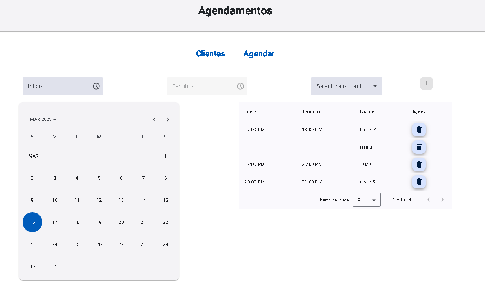
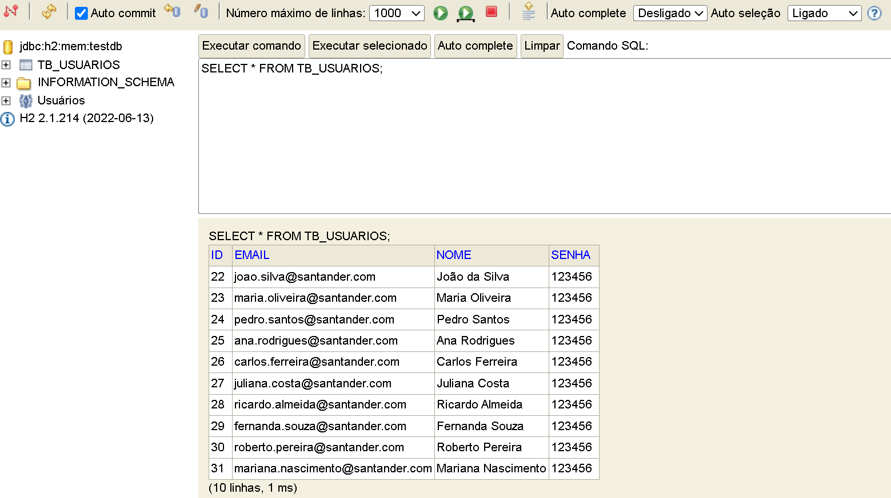
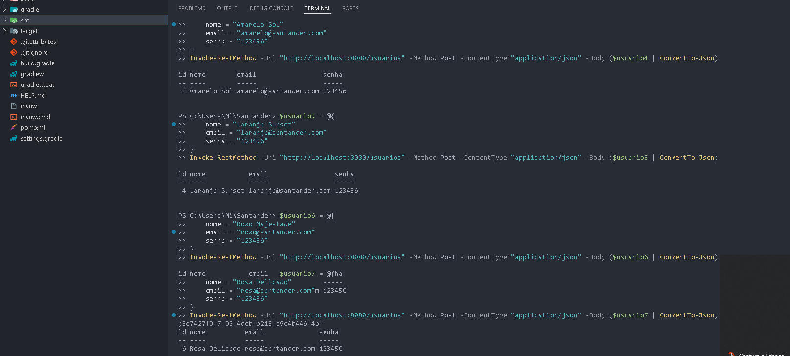

# Sistema de Gerenciamento de Barbearia
---
## Screenshots

        
  
  
  

---
## Visão Geral
Este é um sistema completo de gerenciamento para barbearias que permite o cadastro de clientes e agendamento de serviços. O projeto utiliza uma arquitetura full stack moderna, com frontend Angular e backend Java Spring Boot.

## Tecnologias Utilizadas

### Frontend
- **Angular**: Framework para construção da interface do usuário
- **Angular Material**: Biblioteca de componentes de UI
- **TypeScript**: Linguagem de programação baseada em JavaScript com tipagem estática
- **SCSS**: Pré-processador CSS para estilização avançada
---
### Backend
- **Java 21**: Linguagem de programação
- **Spring Boot**: Framework para desenvolvimento de aplicações Java
- **Spring Data JPA**: Simplificação de acesso a dados
- **Flyway**: Controle de versão para banco de dados
- **PostgreSQL**: Sistema de gerenciamento de banco de dados relacional
- **Maven/Gradle**: Gerenciamento de dependências e build
---
## Funcionalidades
- **Gestão de Clientes**:
  - Cadastro de novos clientes
  - Edição de informações
  - Listagem e busca de clientes
  - Exclusão de cadastros
---
- **Gestão de Agendamentos**:
  - Criação de novos agendamentos
  - Visualização de agendamentos por data
  - Verificação automática de disponibilidade de horários
  - Prevenção de conflitos de horários
  - Associação de clientes aos agendamentos
---
## Desafios Superados
Durante o desenvolvimento, enfrentamos e superamos diversos desafios:

1. **Validação de dados**: Consertamos problemas na validação de emails e telefones durante a atualização de clientes.

2. **Manipulação de datas**: Solucionamos problemas com manipulação de datas e horários no sistema de agendamento.

3. **Prevenção de conflitos**: Implementamos lógica para prevenir sobreposição de agendamentos.

4. **Integração frontend-backend**: Resolvemos problemas de comunicação entre Angular e Spring Boot.

5. **Estilização responsiva**: Criamos uma interface que mantém boa aparência em diferentes tamanhos de tela.
---

Agradeço sinceramente a oportunidade de compartilhar este projeto, que, embora simples, representa um marco significativo no meu aprendizado em desenvolvimento web. Reconheço que ainda tenho um longo caminho a percorrer e muito a aprender, mas estou comprometido em continuar me dedicando e aprimorando minhas habilidades. Este projeto foi desenvolvido com a base de referncia da Aula do Pro.Junior na Dio. (
riando um APP Full Stack de Agendamento de Barbearia com Java e Angular ) Decola Tech 2025.

